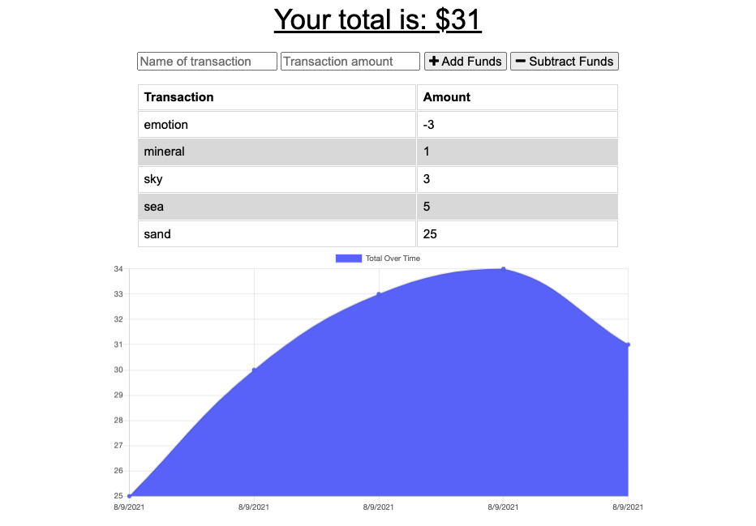

# Budget_Tracker

## Description
- The user will be able to add expenses and deposits to their budget with or without a connection. When entering transactions offline, they should populate the total when brought back online

### Business Context
- Giving users a fast and easy way to track their money is important, but allowing them to access that information anytime is even more important
- Having offline functionality is paramount to our applications success

### The User Story for this project is as follows:
- AS AN avid traveller, I WANT to be able to track my withdrawals and deposits with or without a data/internet connection, SO THAT my account balance is accurate when I am traveling

### The codebase meets the following criteria for acceptance:
- WHEN the user inputs a withdrawal or deposit, THEN that will be shown on the page, and added to their transaction history when their connection is back online

### Installation
- The project is uploaded to [GitHub](https://github.com/) at the following repository: [here](https://github.com/sourslaw/19_Budget_Tracker)
<!-- - The project is deployed via [Heroku](https://www.heroku.com/) at the following link: [here](https://floating-scrubland-33204.herokuapp.com/) -->

### License
- Licensed under the [MIT](https://opensource.org/licenses/mit-license.php) license.